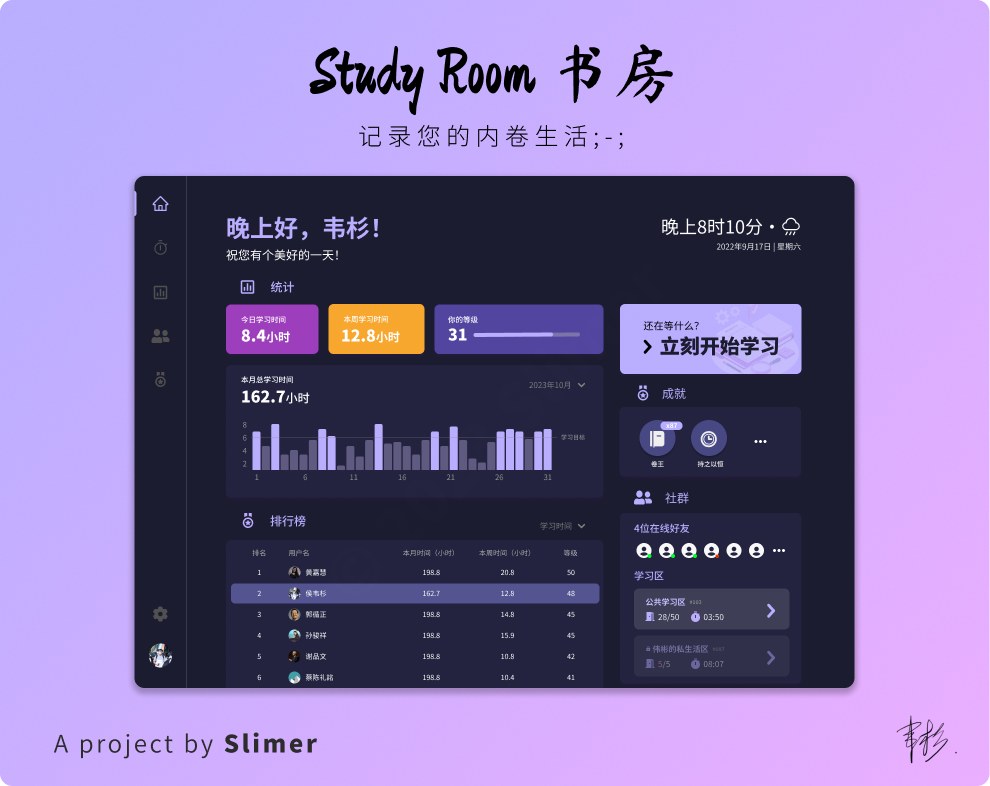

# Study Room 书房

“书房”是一个学习记录应用的计划。原名为“内卷”，但由于名字听起来不顺口而做出了更改。

## 灵感

_纯粹掰出来的~_

某一天，我和几个学霸朋友们聊起了学习的东西，觉得学习时少了许多动力。因此，我们通过产生学习竞争的方式，尝试相互鼓励。

这方法显然实行出来是较难的——如何产生竞争，如何将竞争转化为动力？

> “有比较就有伤害” 

将学习时间进行排名，我们发现这产生了竞争力。再加上“成就”系统，大家更愿意投入于学习中了。

## 目前的计划

### 1. 主要功能
- [ ] 主页
- [ ] 计时器
- [ ] 统计
- [ ] 社群
- [ ] 成就

- [ ] 设置
- [ ] 用户